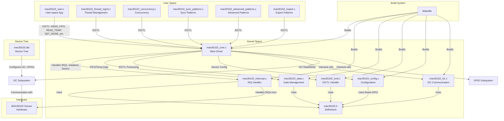

# MAX30102 Sensor Driver for Raspberry Pi with Advanced Multithreading

This project provides a Linux kernel module for the MAX30102 heart rate and SpO2 sensor, integrated with advanced user-space applications demonstrating sophisticated multithreading and synchronization patterns. The driver supports I2C communication, interrupt handling, FIFO management, temperature reading, and IOCTL operations, leveraging Linux subsystems like input, hwmon, debugfs, sysfs, and regulator support. The user-space applications extend functionality with thread management, concurrency patterns, synchronization techniques, and advanced process handling for robust sensor interaction.

## Table of Contents
- [Installation](#installation)
- [Device Tree Configuration](#device-tree-configuration)
- [Usage](#usage)
- [UML Diagram](#uml-diagram)
- [Architecture Flow](#architecture-flow)
- [Files](#files)

## Installation

To install the `max30102_driver` and user-space applications on a Raspberry Pi, follow these steps:

### Step 1: Navigate to the Project Directory
Clone or copy the project files to a directory on your Raspberry Pi (e.g., `/home/pi/max30102_driver`). Ensure all source files (`max30102_*.c`, `max30102.h`, `max30102.dts`, `Makefile`, and user-space files) are present.

```bash
cd /home/pi/max30102_driver
```

### Step 2: Convert Device Tree Blob to Source
Navigate to the `/boot` directory and convert the Raspberry Pi device tree blob (`.dtb`) to a device tree source (`.dts`) using the `dtc` command, selecting the appropriate `.dtb` file for your Raspberry Pi model.

```bash
cd /boot
dtc -I dtb -O dts -o bcm2710-rpi-3-b.dts bcm2710-rpi-3-b.dtb
```

**Note**: Replace `bcm2710-rpi-3-b.dtb` with the correct `.dtb` file (e.g., `bcm2711-rpi-4-b.dtb` for Raspberry Pi 4).

### Step 3: Modify the Device Tree
Edit the `.dts` file (e.g., `bcm2710-rpi-3-b.dts`) and locate the `i2c1` node. Integrate the MAX30102 device tree overlay from `max30102.dts`:

```dts
/dts-v1/;
/plugin/;

/ {
    compatible = "brcm,bcm2711";

    fragment@0 {
        target = <&i2c1>;
        __overlay__ {
            status = "okay";

            max30102: max30102@57 {
                compatible = "maxim,max30102";
                reg = <0x57>;
                int-gpios = <&gpio 17 0>;
                reset-gpios = <&gpio 18 0>;
                led1-current-mA = <6>;
                led2-current-mA = <6>;
                interrupt-parent = <&gpio>;
                interrupts = <17 IRQ_TYPE_EDGE_FALLING>;
                vcc-supply = <&regulator_vcc>;
                #io-channel-cells = <0>;
            };
        };
    };
};
```

Alternatively, apply `max30102.dts` directly as an overlay (see [Device Tree Configuration](#device-tree-configuration)).

### Step 4: Recompile and Apply Device Tree
Recompile the modified `.dts` file to `.dtb` and reboot the Raspberry Pi:

```bash
dtc -I dts -O dtb -o bcm2710-rpi-3-b.dtb bcm2710-rpi-3-b.dts
sudo reboot
```

**Note**: Use the appropriate `.dtb` and `.dts` filenames for your Raspberry Pi model.

### Step 5: Build and Install the Driver
Return to the project directory and build the kernel module using the `Makefile`:

```bash
cd /home/pi/max30102_driver
make
```

This compiles `max30102_core.o`, `max30102_i2c.o`, `max30102_interrupt.o`, `max30102_config.o`, `max30102_data.o`, and `max30102_ioctl.o` into `max30102_driver.ko`. Install the driver:

```bash
sudo insmod max30102_driver.ko
```

Verify installation:

```bash
dmesg | grep max30102
```

To remove the driver:

```bash
sudo rmmod max30102_driver
```

### Step 6: Build and Run the User Applications
Compile the user-space applications (`max30102_user.c`, `max30102_thread_mgmt.c`, `max30102_concurrency.c`, `max30102_sync_patterns.c`, `max30102_advanced_patterns.c`, `max30102_expert.c`):

```bash
gcc max30102_user.c -o max30102_user -pthread -lrt
gcc max30102_thread_mgmt.c -o max30102_thread_mgmt -pthread -lrt
gcc max30102_concurrency.c -o max30102_concurrency -pthread -lrt
gcc max30102_sync_patterns.c -o max30102_sync_patterns -pthread -lrt
gcc max30102_advanced_patterns.c -o max30102_advanced_patterns -pthread -lrt
gcc max30102_expert.c -o max30102_expert -pthread -lrt
```

Run any application, e.g.:

```bash
./max30102_user
./max30102_thread_mgmt
```

Clean up generated files:

```bash
make clean
rm -f max30102_user max30102_thread_mgmt max30102_concurrency max30102_sync_patterns max30102_advanced_patterns max30102_expert
```

## Device Tree Configuration

The `max30102.dts` file configures the MAX30102 sensor on the I2C bus at address `0x57`, with interrupt GPIO (pin 17), reset GPIO (pin 18), regulator support, and hwmon integration. To apply the overlay directly:

1. Compile the overlay:

```bash
dtc -@ -I dts -O dtb -o max30102.dtbo max30102.dts
```

2. Apply the overlay:

```bash
sudo dtoverlay max30102.dtbo
```

3. Remove the overlay:

```bash
sudo dtoverlay -r max30102
```

**Note**: Enable the I2C interface via `sudo raspi-config` ("Interfacing Options" -> "I2C" -> "Enable").

## Usage

The driver exposes a misc device (`/dev/max30102`) controlled via IOCTLs defined in `max30102.h`. The user-space applications demonstrate various functionalities:

- **max30102_user.c**: Opens the device with `O_RDWR | O_NONBLOCK`, handles signals (SIGINT, SIGTERM, SIGUSR1), configures sensor settings (mode, slots, FIFO, SpO2) using IOCTLs, and implements process management (`fork`, `execvp`), thread synchronization (mutex, condition variables), and IPC (message queue, pipe, FIFO, shared memory).
- **max30102_thread_mgmt.c**: Demonstrates thread creation with race handling (barrier, mutex), custom stack sizes, real-time scheduling (SCHED_FIFO), and a map-reduce pattern for processing FIFO data in parallel.
- **max30102_concurrency.c**: Implements producer-consumer concurrency with strict alternation (semaphores), overlapping I/O and computation, and performance benchmarking for throughput analysis.
- **max30102_sync_patterns.c**: Showcases advanced synchronization with read-write locks, custom FIFO-based strong semaphores, inter-process semaphores (via `sem_open`), and a dynamic publish-subscribe pattern for event handling.
- **max30102_advanced_patterns.c**: Includes deadlock detection (try-lock with timeout), dining philosophers implementation, listener-worker delegation, assembly line processing, and a COVID vaccination queue monitor with bounded waiting.
- **max30102_expert.c**: Demonstrates event pair synchronization (dual condition variables), fork handling in multi-threaded environments (`pthread_atfork`), and bounded waiting with timeouts.

Example IOCTL commands (used across applications):
- Set SpO2 mode: `ioctl(fd, MAX30102_IOC_SET_MODE, &mode)` with `mode = MAX30102_MODE_SPO2`.
- Read FIFO: `ioctl(fd, MAX30102_IOC_READ_FIFO, &fifo_data)`.
- Read temperature: `ioctl(fd, MAX30102_IOC_READ_TEMP, &temp)`.

The driver supports heart rate and SpO2 calculations in `max30102_data.c`, reporting via the input subsystem (`ABS_HEART_RATE`, `ABS_SPO2`), and exposes sysfs attributes (`temperature`, `status`, `led_current`) for monitoring.

## UML Diagram

Below is a UML class diagram illustrating the relationships between the MAX30102 driver components and user applications:

```plaintext
@startuml
package "Kernel Module" {
  [max30102_data] --> [max30102_core]
  [max30102_data] --> [max30102_ioctl]
  [max30102_data] --> [max30102_interrupt]
  [max30102_data] --> [max30102_config]
  [max30102_data] --> [max30102_data] : FIFO/temp processing
  [max30102_data] --> [max30102_i2c]
  [max30102_core] --> [max30102.h]
  [max30102_ioctl] --> [max30102.h]
  [max30102_interrupt] --> [max30102.h]
  [max30102_config] --> [max30102.h]
  [max30102_data] --> [max30102.h]
  [max30102_i2c] --> [max30102.h]
  [max30102_core] --> [I2C Subsystem]
  [max30102_core] --> [GPIO Subsystem]
  [max30102_core] --> [Misc Device]
  [max30102_core] --> [Input Subsystem]
  [max30102_core] --> [Hwmon Subsystem]
  [max30102_core] --> [Debugfs]
}

package "Device Tree" {
  [max30102.dts] --> [I2C Subsystem]
}

package "User Space" {
  [max30102_user] --> [max30102.h]
  [max30102_thread_mgmt] --> [max30102.h]
  [max30102_concurrency] --> [max30102.h]
  [max30102_sync_patterns] --> [max30102.h]
  [max30102_advanced_patterns] --> [max30102.h]
  [max30102_expert] --> [max30102.h]
  [max30102_user] --> [max30102_core] : IOCTL
  [max30102_thread_mgmt] --> [max30102_core] : IOCTL
  [max30102_concurrency] --> [max30102_core] : IOCTL
  [max30102_sync_patterns] --> [max30102_core] : IOCTL
  [max30102_advanced_patterns] --> [max30102_core] : IOCTL
  [max30102_expert] --> [max30102_core] : IOCTL
}

[max30102.h] : Defines structs, IOCTLs, registers
[max30102_data] : FIFO and temperature reading
[max30102_ioctl] : IOCTL handling
[max30102_interrupt] : Interrupt handling
[max30102_config] : Sensor configuration
[max30102_i2c] : I2C communication
[max30102_core] : Main driver logic
[max30102_user] : Basic user-space application
[max30102_thread_mgmt] : Thread management and map-reduce
[max30102_concurrency] : Producer-consumer concurrency
[max30102_sync_patterns] : Advanced synchronization patterns
[max30102_advanced_patterns] : Deadlock detection, dining philosophers, etc.
[max30102_expert] : Event pair, fork handling
[max30102.dts] : Device tree overlay
@enduml
```

This diagram illustrates:
- `max30102.h` defines shared structures (`max30102_data`, `max30102_fifo_data`, `max30102_slot_config`), IOCTLs, and register macros.
- `max30102_data` is central, used by all kernel components for FIFO and temperature data.
- `max30102_core` integrates with Linux subsystems (I2C, GPIO, Misc Device, Input, Hwmon, Debugfs).
- User-space applications (`max30102_user`, etc.) interact with the kernel via IOCTLs.
- `max30102.dts` configures I2C and GPIO settings.


## Architecture Flow

The MAX30102 driver architecture is modular, with clear separation of concerns. Below is a Mermaid flowchart depicting the data flow and interactions:



**Flow Description**:
1. **User Space**:
   - Applications (`max30102_user.c`, `max30102_thread_mgmt.c`, etc.) open `/dev/max30102`, configure the sensor via IOCTLs, and read FIFO/temperature data.
   - Use `poll()` for efficient data access, threads for continuous monitoring, and advanced synchronization (e.g., barriers, semaphores, condition variables, recursive mutexes) for thread safety.
   - Implement IPC (message queue, pipe, FIFO, shared memory), process management (`fork`, `execvp`), and advanced patterns like map-reduce, dining philosophers, and COVID queue monitors.

2. **Kernel Space**:
   - `max30102_core.c`: Registers the misc device, manages IRQs (`max30102_irq_handler`), and initializes the sensor via `max30102_config.c`. Supports file operations (`max30102_fops`), sysfs attributes, input subsystem (`input_dev`), hwmon (`hwmon_dev`), and debugfs.
   - `max30102_interrupt.c`: Handles interrupts (e.g., FIFO full, PPG ready) via a workqueue (`max30102_work_handler`), storing data in `max30102_data` buffers.
   - `max30102_data.c`: Reads FIFO data with auto-clear (`max30102_clear_fifo`) and temperature (`max30102_read_temperature`), calculating heart rate and SpO2 using peak detection and calibration formulas.
   - `max30102_ioctl.c`: Processes IOCTLs (`max30102_ioctl`, `max30102_compat_ioctl`) for user-space configuration and data retrieval.
   - `max30102_config.c`: Initializes the sensor (`max30102_init_sensor`) with hardware/software reset and configures mode, slots, FIFO, and SpO2 settings.
   - `max30102_i2c.c`: Manages I2C communication (`max30102_read_reg`, `max30102_write_reg`) with retries for reliability.

3. **Device Tree** (`max30102.dts`):
   - Configures the MAX30102 at I2C address `0x57`, with interrupt GPIO (pin 17), reset GPIO (pin 18), and regulator support.

4. **Hardware**:
   - The MAX30102 sensor generates Red/IR data, triggers interrupts, and communicates via I2C.

5. **Build System** (`Makefile`):
   - Compiles and links `max30102_*.o` into `max30102_driver.ko` for kernel module deployment.

**Data Flow**:
- Sensor data triggers interrupts, handled by `max30102_interrupt.c`, storing Red/IR samples in `max30102_data` buffers.
- `max30102_data.c` processes FIFO data, calculates heart rate/SpO2, and reports via input subsystem.
- User-space applications retrieve data via IOCTLs (`max30102_ioctl.c`), with `poll()` ensuring efficient data access and advanced threading patterns for processing.

## Files
- `max30102.h`: Defines register macros, IOCTLs (`MAX30102_IOC_*`), structures (`max30102_data`, `max30102_fifo_data`, `max30102_slot_config`), and function prototypes.
- `max30102_core.c`: Implements main driver logic, including probe (`max30102_probe`), file operations (`max30102_fops`), sysfs attributes, and subsystem integrations (input, hwmon, debugfs).
- `max30102_i2c.c`: Provides I2C read/write functions (`max30102_read_reg`, `max30102_write_reg`) with retry logic.
- `max30102_interrupt.c`: Manages interrupts (`max30102_irq_handler`, `max30102_work_handler`) for FIFO, PPG, ALC overflow, and temperature events.
- `max30102_config.c`: Handles sensor initialization (`max30102_init_sensor`) and configuration (`max30102_set_mode`, `max30102_set_slot`, `max30102_set_fifo_config`, `max30102_set_spo2_config`).
- `max30102_data.c`: Processes FIFO data (`max30102_read_fifo`) with auto-clear and temperature (`max30102_read_temperature`), including heart rate/SpO2 calculations.
- `max30102_ioctl.c`: Implements IOCTL handlers (`max30102_ioctl`, `max30102_compat_ioctl`) for user-space configuration and data retrieval.
- `max30102.dts`: Configures I2C, GPIOs, and regulator for the MAX30102 sensor.
- `max30102_user.c`: Basic user-space application for interacting with the driver, demonstrating IOCTLs, threads, IPC, and process management.
- `max30102_thread_mgmt.c`: Demonstrates thread creation, race handling, custom stack, real-time scheduling, and map-reduce pattern for FIFO data processing.
- `max30102_concurrency.c`: Implements producer-consumer concurrency with strict alternation and performance benchmarking.
- `max30102_sync_patterns.c`: Showcases read-write locks, FIFO-based strong semaphores, inter-process semaphores, and publish-subscribe patterns.
- `max30102_advanced_patterns.c`: Includes deadlock detection, dining philosophers, listener-worker delegation, assembly line processing, and a COVID queue monitor.
- `max30102_expert.c`: Demonstrates event pair synchronization, fork handling in multi-threaded environments, and bounded waiting.
- `Makefile`: Builds the kernel module (`max30102_driver.ko`) and supports cleanup.

This driver and its user-space applications provide a robust, modular interface for the MAX30102 sensor, enabling heart rate and SpO2 monitoring on Raspberry Pi with advanced Linux kernel integration and sophisticated multithreading techniques.
